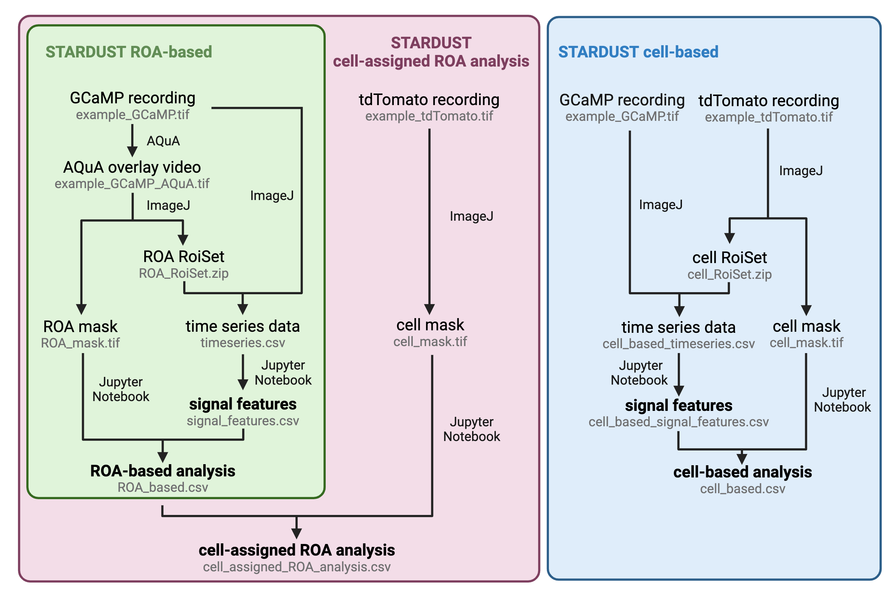

# STARDUST

STARDUST (Spatio-Temporal Analysis of Regional Dynamics &amp; Unbiased Sorting of Transients) is a pipeline that captures intracellular calcium (Ca2+) dynamics in confined, local micro-domains across the territory of all astrocytes within the field of view. STARDUST is developed and maintained by the [Papouin lab](https://sites.wustl.edu/papouinlab/) at Washington Univeristy in St. Louis. We welcome suggestions and issue reporting via the email to Yifan Wu (yifan.wu@wustl.edu) and Yanchao Miko Dai (d.miko@wustl.edu). 

This repository hosts code for the signal detection and feature extraction part of STARDUST. To meet the needs of more users in the astrocyte field, we have adapted STARDUST to three versions: STARDUST, STARDUST ROA-based, and STARDUST cell-based. 

For a full description of the protocol, please refer to our paper [*STARDUST: a pipeline for the unbiased analysis of astrocyte regional calcium dynamics*](https://doi.org/10.1101/2024.04.04.588196). 

# Table of contents
- [STARDUST](#stardust)
- [Overview](#overview)
- [Example data](#exampledata)
- [Updates](#updates)
- [Reference](#reference)

# Overview

STARDUST builds upon [AQuA](https://github.com/yu-lab-vt/AQuA/), a popular open-source fluorescence analysis platform, to yield maps of regions of activity (ROAs) from patches of active signals, which can be combined with cell-segmentation and/or correlated to cellular morphology. Importantly, STARDUST makes no assumption regarding Ca2+ propagation across ROAs, in line with the seemingly static nature of astrocyte Ca2+ activity. Instead, STARDUST treats ROAs as independent units and focuses on decomposing Ca2+ dynamics in a regionalized fashion, yielding around 20 ROAs per cell, or thousands across the field of view, and extracting fluorescence time-series, signals and signal features from each of them. A particular instantiation of the usefulness of STARDUST is in pharmacology experiments, where it can distinguish “stable ROAs” (active throughout the recording), from “ON ROAs” (inactive at baseline epoch and turned on during drug application), and “OFF ROAs” (active at baseline and turned off during drug application). Together, this makes STARDUST a user-friendly complement or alternative to the small number of publicly available algorithms and tools recently developed to tackle astrocyte Ca2+ activity. This protocol includes step-by-step guidelines, tips on how to use STARDUST and outlines multiple output examples, providing a systematic walkthrough of its core functionalities, limitation, and tunability.

# Example data 
Example data and analyses are deposited on zenodo https://zenodo.org/doi/10.5281/zenodo.13126733. The data consist of raw recordings from ex vivo astrocyte GCaMP6f (Ca2+ activity) and tdTomato (static marker) bath perfused with norepinephrine (at 200nM) and downstream analyses with STARDUST.

# Updates
2024/05/30: Make repository public.   
2024/07/29: Add STARDUST ROA-based and STARDUST cell-based versions.   

# Reference
Wu, Y., Dai, Y., Lefton, K. B., Holy, T. E. & Papouin, T. [*STARDUST: a pipeline for the unbiased analysis of astrocyte regional calcium dynamics.*](https://doi.org/10.1101/2024.04.04.588196) bioRxiv 2024.04.04.588196 (2024) doi:10.1101/2024.04.04.588196.  

# Acknowledgement
We would like to acknowlege Jiaxin Chelsy Li (at Tufts University) for designing the STARDUST logo. 