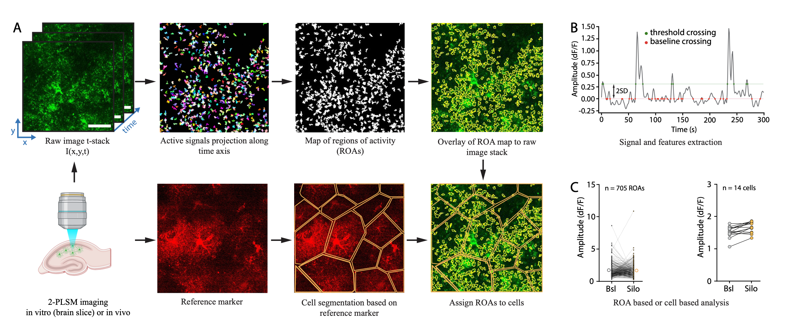

# STARDUST
STARDUST (Spatio-Temporal Analysis of Regional Dynamics &amp; Unbiased Sorting of Transients) is a python-based pipeline for analyzing astrocyte calcium recordings. 

STARDUST builds on [AQuA](https://github.com/yu-lab-vt/AQuA/) to identify patches of active voxels, from which it builds a map of regions of activity (ROAs) that can be combined with cell-segmentation and/or correlated to cellular morphology. For each ROA, STARDUST extracts fluorescence time-series, and performs signal identification and features extraction. STARDUST is agnostic to cell morphology (or cells altogether) and putative calcium propagation across ROAs. Instead, it focuses on decomposing calcium dynamics in a regionalized fashion by treating ROAs as independent units, for instance allowing investigations of signal feature-based ranked ROAs. STADUST is also able to categorize ROAs as “stable” (active throughout the recording), “ON” (turns on during drug application) and “OFF” (turns off during drug application) in pharmacology experiments, permitting studies of astrocyte calcium “micro-domains” based on their functional responses rather than anatomical attribute. With a systematic set of instructions and troubleshooting tips, and minimal computational/coding background required, STARDUST is a user-friendly addition to the growing toolbox for the exploration of astrocyte calcium dynamics.

More details about the pipeline is available on biorxiv: STARDUST: a pipeline for the unbiased analysis of astrocyte regional calcium dynamics. 

STARDUST is developed and maintained by the [Papouin lab](https://sites.wustl.edu/papouinlab/) at Washington Univeristy in St. Louis. We welcome suggestions and issue reporting via the Issue section on GitHub, or you can send an email to Thomas Papouin (Thomas.papouin@wustl.edu). 